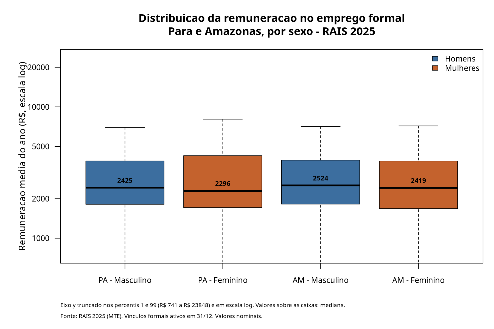
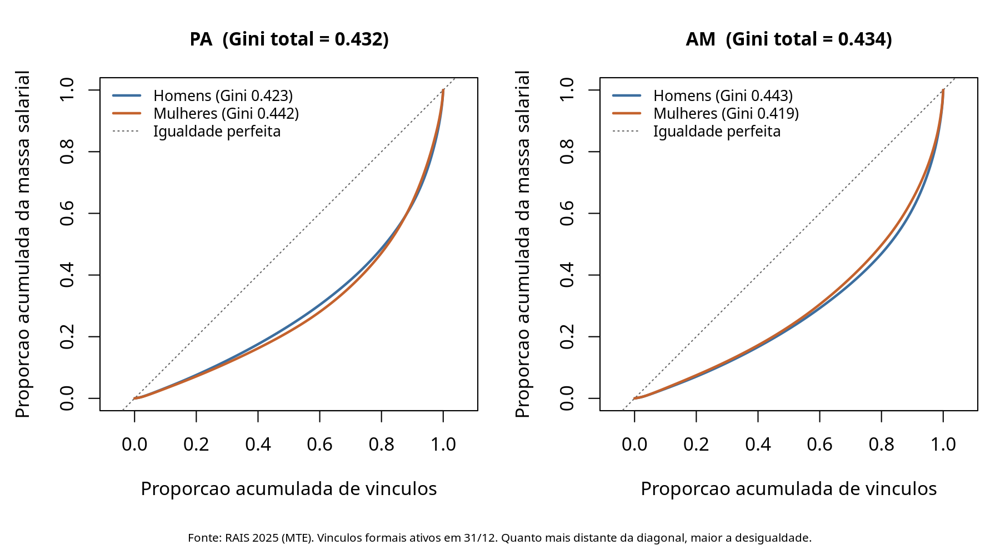
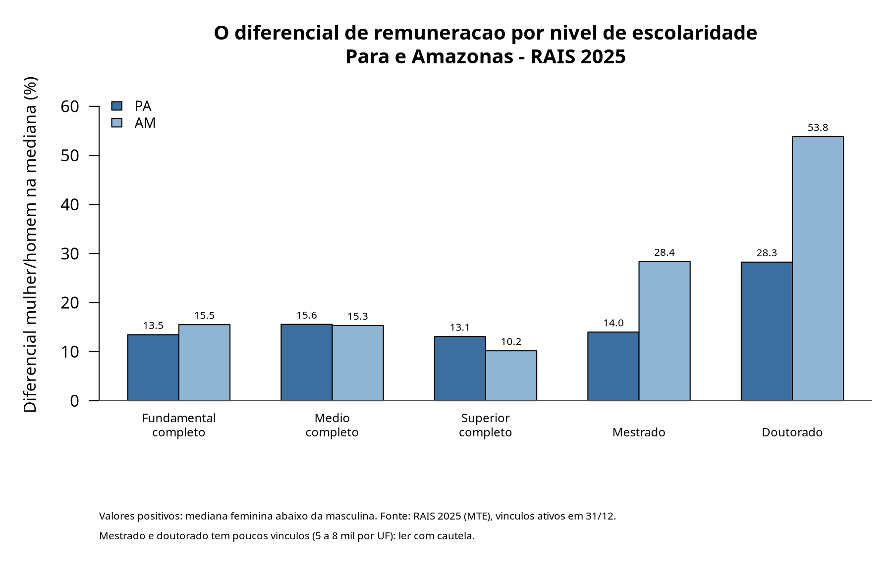

```{r setup, include=FALSE}
knitr::opts_chunk$set(echo = FALSE, message = FALSE, warning = FALSE,
                      fig.align = "center")
res <- readRDS("../dados/resultados.rds")
fmt_n   <- function(x) format(round(x), big.mark = ".", decimal.mark = ",", scientific = FALSE)
fmt_rs  <- function(x) paste0("R$ ", format(round(x, 2), big.mark = ".", decimal.mark = ",", nsmall = 2))
fmt_pct <- function(x, d = 1) paste0(format(round(100 * x, d), decimal.mark = ",", nsmall = d), "%")
tab_desc <- res$tab_desc; tab_gap <- res$tab_gap
tab_gini <- res$tab_gini; gini_uf <- res$gini_uf; tab_esc <- res$tab_esc
```

## A proposta que estamos examinando

**Lula (PT)** — avançar na "efetiva equivalência remuneratória entre mulheres e
homens", tornando **obrigatória** a execução dos Planos de Ação da Lei de
Igualdade Salarial, com metas progressivas.

O tema atravessa o espectro:

- **Augusto Cury (Avante)** — transparência salarial e fiscalização; cita ~**21%**
  de diferença média em empresas com 100+ empregados.
- **Ronaldo Caiado (PSD)** — critérios objetivos e selo "Empresa pela Igualdade".

<div class="notes">
Abrir dizendo que a proposta não é controversa no diagnóstico, e sim no
instrumento. Nosso trabalho é sobre o instrumento: como medir.
</div>

## A pergunta

> No emprego formal do **Pará** e do **Amazonas** em 2025, qual é o diferencial de
> remuneração entre mulheres e homens — e ele se comporta do mesmo modo nos dois
> estados?

E a pergunta que organiza o diagnóstico:

> **Um indicador agregado é suficiente para orientar a fiscalização que as
> propostas prometem?**

**Recorte:** sexo × UF (PA vs AM) — os dois maiores mercados formais do Norte,
63% dos vínculos da região, com estruturas produtivas distintas.

## Dados e universo

- **Fonte:** microdados públicos da RAIS 2025, arquivo de vínculos (MTE).
- **Unidade de análise:** o **vínculo**, não a pessoa.
- **Base bruta (Norte):** `r fmt_n(res$passos$n[1])` vínculos.
- **Base analítica:** **`r fmt_n(res$n_final)`** vínculos.

Filtros: UF em PA/AM → vínculo ativo em 31/12 → sexo informado → remuneração > 0
→ jornada > 0.

O filtro de **vínculo ativo em 31/12** é o mais custoso (remove
`r fmt_n(res$passos$removidos[3])`). Sem ele, vínculos de poucos meses entrariam
com remuneração deprimida por **tempo de exposição**, não por salário.

## Primeiro resultado: o diferencial agregado é pequeno

```{r out.width="82%"}

```

Medianas entre `r fmt_rs(min(tab_desc$mediana))` e `r fmt_rs(max(tab_desc$mediana))`.
Diferencial: `r fmt_pct(tab_gap["PA","gap_mediana"],1)` no PA,
`r fmt_pct(tab_gap["AM","gap_mediana"],1)` no AM.

## Cuidado: média e mediana discordam

No **Pará**, a média feminina é **maior** que a masculina, mas a mediana é
**menor**.

| | Média | Mediana | P90 |
|---|---|---|---|
| PA — Homens | `r fmt_rs(tab_desc["PA - Masculino","media"])` | `r fmt_rs(tab_desc["PA - Masculino","mediana"])` | `r fmt_rs(tab_desc["PA - Masculino","p90"])` |
| PA — Mulheres | `r fmt_rs(tab_desc["PA - Feminino","media"])` | `r fmt_rs(tab_desc["PA - Feminino","mediana"])` | `r fmt_rs(tab_desc["PA - Feminino","p90"])` |

Uma **cauda superior feminina** no Pará puxa a média sem deslocar o centro.

> Se o relatório usasse a média, concluiria que **não há desvantagem feminina no
> Pará**. Seria errado.

## Desigualdade: Lorenz e Gini

```{r out.width="88%"}

```

Gini total: **`r format(round(gini_uf[["PA"]],3), decimal.mark=",")`** (PA) e
**`r format(round(gini_uf[["AM"]],3), decimal.mark=",")`** (AM) — alto para uma
distribuição que já exclui a informalidade.

## A desigualdade interna se inverte entre os estados

- **PA:** maior entre **mulheres** (`r format(round(tab_gini[["PA - Feminino"]],3), decimal.mark=",")`)
  que entre homens (`r format(round(tab_gini[["PA - Masculino"]],3), decimal.mark=",")`).
- **AM:** maior entre **homens** (`r format(round(tab_gini[["AM - Masculino"]],3), decimal.mark=",")`)
  que entre mulheres (`r format(round(tab_gini[["AM - Feminino"]],3), decimal.mark=",")`).

Diferenciais agregados parecidos, **estruturas de desigualdade opostas**.

Uma meta nacional uniforme trataria os dois estados como casos equivalentes.

## O achado central: o agregado esconde o problema

```{r out.width="80%"}

```

Dentro do mesmo nível de escolaridade, o diferencial vai de **10% a 16%** nos
níveis de maior emprego — e chega a `r fmt_pct(max(tab_esc$gap),1)` no doutorado do AM.

## Por quê: efeito de composição

As mulheres formalmente empregadas em PA e AM são **mais escolarizadas**:
`r fmt_pct(res$comp_pct["Superior completo","Feminino"],1)` têm superior completo,
contra `r fmt_pct(res$comp_pct["Superior completo","Masculino"],1)` dos homens.

Padronizando por escolaridade (média dos gaps internos, ponderada pelo emprego):

| Indicador | Valor |
|---|---|
| Diferencial agregado (bruto) | `r fmt_pct(res$gap_bruto, 2)` |
| Diferencial **padronizado** | **`r fmt_pct(res$gap_padronizado, 2)`** |
| Atribuível à composição | `r format(round(100*(res$gap_padronizado - res$gap_bruto),2), decimal.mark=",")` p.p. |

O diferencial **mais que triplica**.

## O que isso NÃO é

A padronização neutraliza **apenas escolaridade**. Ocupação, setor, porte e
jornada seguem livres.

`r fmt_pct(res$gap_padronizado,1)` **não** é "o efeito da discriminação" — é o
diferencial que sobra depois de igualar **uma** dimensão.

Não medimos discriminação: a RAIS não traz função, responsabilidade nem
produtividade, que são os critérios da própria lei.

**Tudo aqui é associação descritiva.**

## Diagnóstico e recomendações

**Diagnóstico:** o diferencial é pequeno no agregado
(`r fmt_pct(res$gap_bruto,1)`) e substancial em estratos comparáveis
(`r fmt_pct(res$gap_padronizado,1)`). A diferença é composição.

1. **Estratificar o monitoramento** — comparar dentro de escolaridade, ocupação e
   jornada. Indicadores agregados subestimam por construção.
2. **Reportar mediana, não só média** — no PA a média inverte o sinal.
3. **Jornada como variável de política** — por hora o gap quase desaparece (~1,3%);
   o problema se desloca para o acesso a jornadas integrais.
4. **Necessidade de informação** — distinguir discriminação de segregação exigiria
   CBO detalhada e trajetórias, que os microdados públicos não permitem.

## Ressalva obrigatória

> A RAIS cobre **apenas vínculos formais declarados**. Informalidade, desemprego
> e pessoas fora da força de trabalho **não** estão representados. Nada aqui pode
> ser generalizado para o mercado de trabalho brasileiro.

Na região Norte, onde a informalidade é historicamente acima da média nacional,
é plausível que as desigualdades sejam **maiores** justamente na parte do mercado
que a base não observa.

Unidade de análise: o vínculo, não a pessoa. Valores nominais.

## Obrigado

Perguntas.

**Reprodutibilidade:** `R/00-baixar-dados.sh` → `R/01-preparar-rais.R` →
`R/02-analise.R` → relatório. Apenas **R base** na análise.

<div class="notes">
Checklist mental para a sabatina:
- Saber recalcular o gap na mediana na hora.
- Saber explicar por que a média inverte no PA (cauda superior, P90).
- Saber explicar a fórmula do Gini e o que a curva de Lorenz mostra.
- Saber explicar a padronização como média ponderada de gaps internos.
- Saber dizer o que a análise NÃO permite concluir.
</div>
