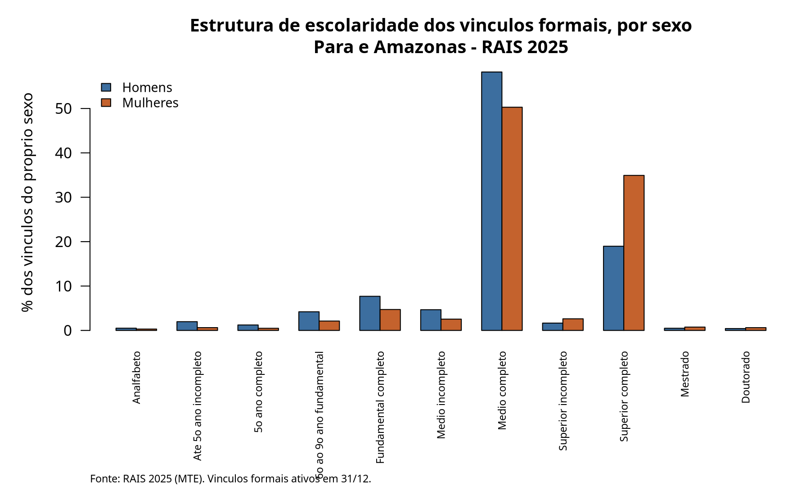

```{r setup, include=FALSE}
knitr::opts_chunk$set(
  echo    = TRUE,     # o código fica visível: a rubrica 8 avalia reprodutibilidade
  message = FALSE,
  warning = FALSE,
  fig.align = "center"
)

# Formatadores usados no texto corrido.
fmt_n   <- function(x) format(round(x), big.mark = ".", decimal.mark = ",", scientific = FALSE)
fmt_rs  <- function(x) paste0("R$ ", format(round(x, 2), big.mark = ".", decimal.mark = ",", nsmall = 2))
fmt_pct <- function(x, d = 1) paste0(format(round(100 * x, d), decimal.mark = ",", nsmall = d), "%")
```

```{r dados}
# Os resultados vêm dos scripts do projeto, nesta ordem:
#   bash R/00-baixar-dados.sh NORTE   -> baixa e descompacta os microdados
#   Rscript R/01-preparar-rais.R      -> leitura, tipagem, rótulos, UF
#   Rscript R/02-analise.R            -> filtros, indicadores, figuras
# Este relatório consome os objetos gravados por 02-analise.R.
res <- readRDS("../dados/resultados.rds")

tab_desc <- res$tab_desc
tab_gap  <- res$tab_gap
tab_gini <- res$tab_gini
gini_uf  <- res$gini_uf
tab_esc  <- res$tab_esc
passos   <- res$passos
```

# Proposta, pergunta e recorte

## O eixo programático

Este trabalho examina o eixo da **igualdade salarial e do combate à discriminação
no mercado de trabalho**. A proposta-âncora é a do programa de **Lula (PT)**, que
promete avançar na "efetiva equivalência remuneratória entre mulheres e homens,
fortalecendo a implementação da Lei de Igualdade Salarial", tornando obrigatória
a execução dos Planos de Ação nas empresas com desigualdades identificadas, com
"metas progressivas de redução das disparidades salariais".

O tema aparece em programas de orientações distintas, o que reforça sua
relevância pública. **Augusto Cury (Avante)** propõe fortalecer "transparência
salarial, fiscalização e cumprimento da legislação", citando diferença média de
remuneração de aproximadamente **21%** entre mulheres e homens em empresas
brasileiras com 100 ou mais empregados. **Ronaldo Caiado (PSD)** propõe aplicar a
legislação de igualdade remuneratória "com critérios objetivos" e criar um selo
"Empresa pela Igualdade".

## A pergunta analítica

> No emprego formal do Pará e do Amazonas em 2025, qual é o diferencial de
> remuneração entre mulheres e homens, e esse diferencial se comporta do mesmo
> modo nos dois estados?

E, decorrente dela, a pergunta que organiza o diagnóstico: **um indicador
agregado de diferencial salarial é suficiente para orientar a fiscalização que as
propostas prometem?**

## O recorte comparativo

O recorte é **sexo × UF**, comparando **Pará** e **Amazonas** — os dois maiores
mercados formais da região Norte, que concentram 63% dos vínculos da região. São
dois recortes cruzados, o máximo que as diretrizes permitem.

A escolha de PA e AM não é arbitrária: são economias de porte semelhante mas com
estruturas produtivas distintas — o Amazonas tem o polo industrial de Manaus,
enquanto o Pará tem peso maior da extração mineral e do agronegócio. Se o
diferencial salarial fosse determinado apenas por composição setorial,
esperaríamos vê-lo divergir bastante entre os dois estados.

## A ponte analítica, e o que ela não permite

A RAIS permite observar **diferenças de remuneração entre grupos** no emprego
formal declarado. Ela **não** permite identificar discriminação: para isso seria
necessário comparar trabalhadores em funções equivalentes, com a mesma
produtividade e responsabilidade — critérios que a Lei de Igualdade Salarial
menciona e que a base não contém. O que este relatório produz é um **diagnóstico
descritivo** de onde as diferenças são maiores, útil para direcionar
fiscalização, não uma medida de discriminação.

# Contexto e problema

A Lei 14.611/2023 (Lei de Igualdade Salarial) instituiu a obrigação de
transparência salarial e de Planos de Ação para empresas com 100 ou mais
empregados que apresentem disparidades. As propostas eleitorais de 2026 divergem
menos sobre o diagnóstico e mais sobre o instrumento: Lula propõe tornar a
execução dos Planos **obrigatória com metas**, Caiado propõe **selo e critérios
objetivos**, Cury enfatiza **fiscalização e transparência**.

É importante separar três coisas que se confundem no debate:

- **Evidência**: a diferença de remuneração média entre mulheres e homens
  observada em bases administrativas.
- **Opinião**: a atribuição dessa diferença a discriminação, a escolhas
  ocupacionais ou à divisão sexual do cuidado.
- **Promessa**: o compromisso de reduzir a diferença por meio de fiscalização.

Este trabalho se restringe ao primeiro item, e mostra que **o modo de medir muda
a conclusão** — o que tem consequência direta sobre a promessa.

Sobre o número de 21% citado por Cury: ele vem dos Relatórios de Transparência
Salarial do MTE, cujo universo (empresas com 100+ empregados) e metodologia
diferem dos microdados da RAIS usados aqui. Os valores **não são diretamente
comparáveis**, e este relatório não os trata como tal.

# Dados, variáveis e decisões analíticas

## Fonte e unidade de análise

Os dados são os **microdados públicos da RAIS, ano-base 2025**, arquivo de
vínculos, obtidos em `ftp://ftp.mtps.gov.br/pdet/microdados/RAIS/2025/`.

A **unidade de análise é o vínculo empregatício**, não o trabalhador. Um
trabalhador com dois empregos formais aparece duas vezes. Os microdados públicos
são não identificados e não permitem agregar por pessoa.

## O formato real dos arquivos

Vale registrar, porque afeta a reprodutibilidade: o formato dos arquivos de 2025
**não corresponde à documentação oficial**. Verificamos diretamente nos arquivos
que o separador de campos é a **vírgula** (não o ponto-e-vírgula documentado), o
separador decimal é o **ponto**, e o encoding é **Latin-1** (não UTF-8). O
arquivo não contém nenhuma ocorrência de `;`, e a decodificação em UTF-8 falha.

Além disso, o layout mais recente publicado no FTP é de **2020** e descreve 59
variáveis, enquanto o arquivo de 2025 tem **62 colunas**. Três colunas
(`Distritos SP`, `Ind Vínculo Abandonado`, `Categoria Trabalhador`) não têm
descrição oficial e **não foram usadas** neste trabalho.

## Variáveis utilizadas

| Variável | Papel na análise |
|---|---|
| `Vl Rem Média Nom` | Remuneração média do ano, valor nominal — variável de resultado |
| `Sexo - Código` | Grupo de comparação (1 = masculino, 2 = feminino) |
| `Município - Código` | Origem da UF (dois primeiros dígitos do código IBGE) |
| `Escolaridade Após 2005` | Estratificação para o controle de composição |
| `Qtd Hora Contr` | Jornada contratual semanal, para o cálculo por hora |
| `Ind Vínculo Ativo 31/12` | Filtro do universo |
| `IBGE Subsetor` | Caracterização setorial (apêndice) |

## Filtros e o efeito de cada um

```{r filtros}
# Os rótulos são reescritos aqui com acentuação. Os scripts em R/ usam texto
# sem acento de propósito, para não depender da locale do sistema em que
# rodarem; a acentuação fica na camada de apresentação.
rotulos <- c("Região Norte (base bruta)", "UF em PA ou AM",
             "Vínculo ativo em 31/12", "Sexo informado",
             "Remuneração média > 0", "Jornada contratual > 0")
knitr::kable(
  data.frame(
    Passo = rotulos,
    `Vínculos restantes` = fmt_n(passos$n),
    Removidos = fmt_n(passos$removidos),
    `% da base bruta` = paste0(format(passos$pct_da_bruta, decimal.mark = ","), "%"),
    check.names = FALSE
  ),
  align = "lrrr",
  caption = "Efeito de cada filtro sobre a base. Fonte: RAIS 2025 (MTE)."
)
```

Cada filtro tem justificativa:

1. **UF em PA ou AM** — define o recorte comparativo.
2. **Vínculo ativo em 31/12** — garante uma foto no mesmo momento. Sem esse
   filtro, vínculos de poucos meses entrariam com remuneração média do ano
   deprimida por **tempo de exposição**, não por salário, confundindo a
   comparação. Este é o filtro mais custoso: remove
   `r fmt_n(passos$removidos[3])` vínculos.
3. **Sexo informado** — necessário para o recorte. Não removeu nenhum registro,
   o que indica cobertura completa da variável nestas duas UFs.
4. **Remuneração média positiva** — remuneração zero não informa salário.
5. **Jornada contratual positiva** — necessária para a remuneração por hora.

A base analítica final tem **`r fmt_n(res$n_final)` vínculos**.

## Tratamento de dados ausentes

O layout instrui a tratar como ignorado todo valor `-1`, `{ñ class}` ou
`{ñclass}`. Além disso, identificamos sentinelas **não documentadas** e as
tratamos como ausentes: `município = 999999`, `natureza jurídica = 9999`,
bairros e distritos `= 999997`, faixas de remuneração `= 99`, e — achado nosso —
**`faixa etária = 99` combinada com `idade = 0`**, em 27 registros da região
Norte com correlação perfeita entre as duas condições. Idade zero é impossível
para um vínculo formal.

Na base analítica final, nenhuma das variáveis centrais tem ausentes, porque os
filtros já os removeram de forma explícita e contabilizada.

# Indicadores de desigualdade

## Medidas de posição e dispersão

```{r tab-desc}
t1 <- data.frame(
  Grupo    = rownames(tab_desc),
  Vínculos = fmt_n(tab_desc$n),
  Média    = fmt_rs(tab_desc$media),
  Mediana  = fmt_rs(tab_desc$mediana),
  P10      = fmt_rs(tab_desc$p10),
  P90      = fmt_rs(tab_desc$p90),
  CV       = format(round(tab_desc$cv, 2), decimal.mark = ","),
  Gini     = format(round(as.numeric(tab_gini), 3), decimal.mark = ","),
  check.names = FALSE
)
knitr::kable(t1, align = "lrrrrrrr",
  caption = "Remuneração média do ano, nominal, por UF e sexo. Fonte: RAIS 2025 (MTE).")
```

A primeira coisa a notar é que **a média e a mediana contam histórias
diferentes**. No Pará, a média feminina (`r fmt_rs(tab_desc["PA - Feminino","media"])`)
é **maior** que a masculina (`r fmt_rs(tab_desc["PA - Masculino","media"])`),
enquanto a mediana feminina (`r fmt_rs(tab_desc["PA - Feminino","mediana"])`) é
**menor** que a masculina (`r fmt_rs(tab_desc["PA - Masculino","mediana"])`).

A explicação está no P90: `r fmt_rs(tab_desc["PA - Feminino","p90"])` para as
mulheres contra `r fmt_rs(tab_desc["PA - Masculino","p90"])` para os homens. Há
uma cauda superior feminina no Pará que puxa a média para cima sem deslocar o
centro da distribuição. **Usar a média isolada levaria à conclusão de que não há
desvantagem feminina no Pará — e isso seria errado.** Por isso o relatório
trabalha com a mediana.

## O diferencial pela mediana, pela média e por hora

```{r tab-gap}
t2 <- data.frame(
  UF = rownames(tab_gap),
  `Gap mediana`      = fmt_pct(tab_gap[, "gap_mediana"], 2),
  `Gap média`        = fmt_pct(tab_gap[, "gap_media"], 2),
  `Gap mediana/hora` = fmt_pct(tab_gap[, "gap_mediana_hora"], 2),
  `Gap média/hora`   = fmt_pct(tab_gap[, "gap_media_hora"], 2),
  check.names = FALSE
)
knitr::kable(t2, align = "lrrrr",
  caption = "Diferencial mulher/homem. Positivo = remuneração feminina menor. Fonte: RAIS 2025 (MTE).")
```

Pela mediana, o diferencial é de `r fmt_pct(tab_gap["PA","gap_mediana"], 1)` no
Pará e `r fmt_pct(tab_gap["AM","gap_mediana"], 1)` no Amazonas. Pela média, ele
**inverte de sinal no Pará**. E na remuneração por hora, praticamente
desaparece: cerca de 1,3% nos dois estados.

O resultado por hora merece cuidado. Ele indica que a diferença observada no
valor mensal está associada à **jornada contratual**, não ao valor da hora
contratada. Isso não é um resultado tranquilizador: jornada menor está
relacionada à divisão sexual do trabalho de cuidado, tema que aparece
explicitamente em outros programas (Clariana Brandão, Lula). Mas é um resultado
que **desloca o problema** — de "mesma hora, salário diferente" para "acesso
desigual a jornadas integrais".

## Curva de Lorenz e índice de Gini

```{r lorenz, fig.cap="Curvas de Lorenz da remuneração, por UF e sexo. Fonte: RAIS 2025 (MTE).", out.width="100%"}
knitr::include_graphics("../figuras/fig2-lorenz.png")
```

O Gini da remuneração é de **`r format(round(gini_uf[["PA"]],3), decimal.mark=",")`
no Pará** e **`r format(round(gini_uf[["AM"]],3), decimal.mark=",")` no
Amazonas** — níveis próximos, e ambos altos para uma distribuição restrita ao
emprego **formal**, que já exclui a parte mais precária do mercado de trabalho.

A comparação interna por sexo é o ponto interessante, e ela **se comporta de modo
oposto nos dois estados**:

- No **Pará**, a desigualdade é maior entre as mulheres
  (`r format(round(tab_gini[["PA - Feminino"]],3), decimal.mark=",")`) do que
  entre os homens (`r format(round(tab_gini[["PA - Masculino"]],3), decimal.mark=",")`).
- No **Amazonas**, o inverso: maior entre os homens
  (`r format(round(tab_gini[["AM - Masculino"]],3), decimal.mark=",")`) do que
  entre as mulheres (`r format(round(tab_gini[["AM - Feminino"]],3), decimal.mark=",")`).

Ou seja, o grupo feminino paraense é internamente **mais heterogêneo** — coerente
com a cauda superior que identificamos no P90. Uma política calibrada por um
diferencial médio estadual trataria os dois estados como casos semelhantes,
quando a estrutura da desigualdade difere.

# Análise exploratória

## Distribuição da remuneração

```{r boxplot, fig.cap="Distribuição da remuneração por UF e sexo. Fonte: RAIS 2025 (MTE).", out.width="100%"}
knitr::include_graphics("../figuras/fig1-boxplot-remuneracao.png")
```

O boxplot usa **escala logarítmica** porque a distribuição salarial é
fortemente assimétrica à direita; em escala linear as caixas ficariam
comprimidas contra o eixo. O eixo y está **truncado nos percentis 1 e 99** para
legibilidade — nenhuma estatística do relatório foi calculada sobre a base
truncada.

As quatro caixas são visivelmente parecidas. As medianas ficam todas entre
`r fmt_rs(min(tab_desc$mediana))` e `r fmt_rs(max(tab_desc$mediana))`. O que
distingue os grupos não é a posição central, e sim a **largura da caixa e o
alcance do bigode superior**: a caixa feminina do Pará é a mais alta, chegando
mais longe no terceiro quartil. É a assinatura visual do mesmo fenômeno que
apareceu no Gini.

**A leitura honesta deste gráfico é que o diferencial agregado é pequeno.** Se o
relatório parasse aqui, concluiria que o problema que as propostas pretendem
enfrentar é modesto no emprego formal de PA e AM. A próxima seção mostra por que
essa conclusão seria precipitada.

## O diferencial dentro de cada nível de escolaridade

```{r gap-esc, fig.cap="Diferencial mulher/homem na mediana, por nível de escolaridade. Fonte: RAIS 2025 (MTE).", out.width="100%"}
knitr::include_graphics("../figuras/fig3-gap-escolaridade.png")
```

```{r tab-esc}
t3 <- data.frame(
  UF           = tab_esc$uf,
  Escolaridade = tab_esc$escolaridade,
  Vínculos     = fmt_n(tab_esc$n),
  `Mediana homens`   = fmt_rs(tab_esc$med_h),
  `Mediana mulheres` = fmt_rs(tab_esc$med_m),
  Gap = fmt_pct(tab_esc$gap, 1),
  check.names = FALSE
)
knitr::kable(t3, align = "llrrrr",
  caption = "Diferencial por nível de escolaridade. Fonte: RAIS 2025 (MTE).")
```

Quando comparamos mulheres e homens **no mesmo nível de escolaridade**, o
diferencial agregado de 4% a 5% se revela um artefato: ele fica entre **10% e
16%** nos níveis que concentram a maior parte do emprego, e sobe para
**`r fmt_pct(max(tab_esc$gap), 1)`** no doutorado do Amazonas.

Os valores de mestrado e doutorado devem ser lidos com cautela: são de 5 a 8 mil
vínculos por UF, contra centenas de milhares no ensino médio. A diferença entre
PA e AM nesses níveis pode refletir composição institucional local — quais
universidades e órgãos empregam esses profissionais — mais do que um padrão
estável.

## Por que o agregado esconde o diferencial: o efeito de composição

```{r composicao}
gn <- res$gap_nivel
t4 <- data.frame(
  Escolaridade = gn$escolaridade,
  Vínculos     = fmt_n(gn$n),
  `Peso (%)`   = format(round(100 * gn$n / sum(gn$n), 2), decimal.mark = ","),
  `Mediana homens`   = fmt_rs(gn$med_h),
  `Mediana mulheres` = fmt_rs(gn$med_m),
  Gap = fmt_pct(gn$gap, 1),
  check.names = FALSE
)
knitr::kable(t4, align = "lrrrrr",
  caption = "Diferencial por nível de escolaridade, PA e AM somados. Fonte: RAIS 2025 (MTE).")
```

A razão do descolamento é que **as mulheres com vínculo formal em PA e AM são
mais escolarizadas que os homens**: `r fmt_pct(res$comp_pct["Superior completo","Feminino"],1)`
dos vínculos femininos estão no superior completo, contra
`r fmt_pct(res$comp_pct["Superior completo","Masculino"],1)` dos masculinos. Como
escolaridade mais alta paga mais, essa diferença de composição **comprime** o
diferencial agregado.

Para separar os dois efeitos usamos **padronização direta**, que é aritmética
simples: calculamos o diferencial dentro de cada nível de escolaridade e tiramos
a média ponderada desses diferenciais, usando como peso a distribuição de
escolaridade do total de vínculos. O resultado responde à pergunta "qual seria o
diferencial se homens e mulheres tivessem a mesma estrutura de escolaridade?".

| Indicador | Valor |
|---|---|
| Diferencial agregado (bruto, mediana) | **`r fmt_pct(res$gap_bruto, 2)`** |
| Diferencial padronizado por escolaridade | **`r fmt_pct(res$gap_padronizado, 2)`** |
| Diferença atribuível à composição | **`r format(round(100*(res$gap_padronizado - res$gap_bruto), 2), decimal.mark=",")` p.p.** |

O diferencial **mais que triplica** quando se neutraliza a composição
educacional. Este é o principal achado do trabalho.

Uma ressalva importante sobre o que essa conta é: a padronização **não** é uma
estimativa causal nem um controle completo. Ela neutraliza **apenas**
escolaridade. Ocupação, setor, porte do estabelecimento e jornada continuam
livres, e todos eles se distribuem de forma desigual entre os sexos. O número de
`r fmt_pct(res$gap_padronizado, 1)` não é "o efeito da discriminação": é o
diferencial que sobra depois de igualar uma única dimensão.

# Interpretação e diálogo com as fontes

O achado central tem consequência direta sobre as propostas analisadas.

A Lei de Igualdade Salarial e os Planos de Ação que Lula promete tornar
obrigatórios operam sobre **comparações dentro da empresa**. Nossa análise
sugere que essa é a escolha metodologicamente correta, e que o contrário seria
um erro: um monitoramento baseado em **médias agregadas por estado ou por setor**
mostraria, em PA e AM, um diferencial de 4% a 5% — ou até favorável às mulheres,
se usasse a média em vez da mediana no Pará — e concluiria que o problema é
pequeno. Dentro de estratos comparáveis, ele é três vezes maior.

Isso também qualifica o número de 21% citado por Cury. Nosso diferencial
padronizado (`r fmt_pct(res$gap_padronizado, 1)`) é da mesma ordem de grandeza,
ainda que universo e método sejam diferentes; o agregado bruto
(`r fmt_pct(res$gap_bruto, 1)`) não é. A ordem de grandeza citada no debate
público é, portanto, mais compatível com uma comparação estratificada do que com
o agregado simples — o que é um argumento a favor da transparência salarial
detalhada que as três propostas defendem, por razões distintas.

Sobre a divergência entre os estados: PA e AM têm diferenciais agregados
parecidos, mas estruturas internas de desigualdade opostas (Gini feminino maior
no PA, masculino maior no AM) e comportamentos distintos na pós-graduação. Isso
recomenda cautela com metas nacionais uniformes.

**Separando associação de causalidade:** tudo o que este relatório estabelece são
**associações descritivas**. Não medimos discriminação, porque não observamos
função, responsabilidade nem produtividade — os critérios que a própria lei
define. Um diferencial dentro do mesmo nível de escolaridade é compatível com
discriminação, mas também com segregação ocupacional, diferenças de jornada e
trajetórias interrompidas por cuidado.

# Diagnóstico e recomendações

## Diagnóstico

No emprego formal de PA e AM em 2025, o diferencial de remuneração entre
mulheres e homens é **pequeno quando medido no agregado**
(`r fmt_pct(res$gap_bruto, 1)` na mediana) e **substancial quando medido dentro
de níveis comparáveis de escolaridade** (`r fmt_pct(res$gap_padronizado, 1)`
padronizado; 10% a 16% nos níveis de maior emprego). A diferença entre as duas
medidas — `r format(round(100*(res$gap_padronizado - res$gap_bruto), 1), decimal.mark=",")`
pontos percentuais — é efeito de composição: as mulheres formalmente empregadas
nesses estados são mais escolarizadas.

## Recomendações

1. **Estratificar o monitoramento.** A fiscalização prometida pelas propostas
   deve comparar remunerações **dentro** de estratos de escolaridade, ocupação e
   jornada. Indicadores agregados por UF ou setor subestimam o problema por
   construção.
2. **Reportar mediana, não só média.** O caso do Pará é demonstração: a média
   inverte o sinal do diferencial. Relatórios de transparência que usem médias
   podem produzir conclusões opostas às da mediana.
3. **Tratar jornada como variável de política, não como controle.** O
   diferencial quase desaparece por hora contratada e reaparece no valor mensal.
   Isso sugere que o acesso desigual a jornadas integrais é parte do mecanismo —
   o que conecta o tema às propostas de rede de cuidado.
4. **Necessidade de informação.** Para distinguir discriminação de segregação
   ocupacional seria preciso cruzar CBO em nível detalhado com porte e
   remuneração, e idealmente acompanhar trajetórias — o que os microdados
   públicos não identificados não permitem.

## Limites e possíveis efeitos distributivos

Uma política calibrada apenas pelo indicador agregado tenderia a **desprioriza**
PA e AM, que apareceriam como casos de baixo diferencial. O efeito distributivo
seria concentrar fiscalização onde o agregado é alto, que não é necessariamente
onde o diferencial dentro de estratos comparáveis é maior.

# Ressalva obrigatória sobre a fonte

**A RAIS cobre apenas vínculos formais declarados.** Informalidade, desemprego e
pessoas fora da força de trabalho não estão representados. Nenhum resultado deste
relatório pode ser generalizado para o mercado de trabalho brasileiro como um
todo. Na região Norte, onde a informalidade é historicamente mais alta que a
média nacional, essa limitação é especialmente relevante: é plausível que as
desigualdades sejam maiores justamente na parte do mercado que a base não
observa.

A unidade de análise é o **vínculo**, não a pessoa. Os valores são **nominais**,
sem deflacionamento.

# Apêndice de transparência metodológica

## Universo e filtros

Descritos na seção 3, com a tabela do efeito de cada filtro. Base bruta da região
Norte: `r fmt_n(passos$n[1])` vínculos. Base analítica final:
`r fmt_n(res$n_final)` vínculos, `r format(round(100*res$n_final/passos$n[1],2), decimal.mark=",")`%
da bruta.

## Definições dos indicadores

**Diferencial (gap):** `1 - (valor das mulheres / valor dos homens)`. Positivo
indica remuneração feminina menor.

**Índice de Gini:** calculado pela forma ordenada
$G = \frac{2\sum_{i=1}^{n} i \cdot x_i}{n \sum_{i=1}^{n} x_i} - \frac{n+1}{n}$,
com $x$ ordenado de forma crescente. É algebricamente equivalente à razão entre
a área entre a diagonal e a curva de Lorenz e a área total sob a diagonal.

**Curva de Lorenz:** proporção acumulada de vínculos no eixo x contra proporção
acumulada da massa de remuneração no eixo y. Reduzida a 500 pontos para
plotagem; o Gini é calculado sobre todas as observações.

**Remuneração por hora:** `rem_media_nom / (horas_contr * 4,345)`, onde 4,345 =
52/12 semanas por mês.

**Padronização direta:** média dos diferenciais internos de cada nível de
escolaridade, ponderada pela participação de cada nível no total de vínculos.

## Composição por escolaridade

```{r fig-comp, fig.cap="Estrutura de escolaridade dos vínculos, por sexo. Fonte: RAIS 2025 (MTE).", out.width="100%"}

```

## Remuneração por hora, detalhada

```{r tab-hora}
th <- as.data.frame(res$tab_hora)
knitr::kable(
  data.frame(Grupo = rownames(th), Vínculos = fmt_n(th$n),
             Média = fmt_rs(th$media), Mediana = fmt_rs(th$mediana),
             P10 = fmt_rs(th$p10), P90 = fmt_rs(th$p90), check.names = FALSE),
  align = "lrrrrr",
  caption = "Remuneração por hora (R$/h). Fonte: RAIS 2025 (MTE).")
```

## Limitações

1. A RAIS observa apenas o emprego formal declarado.
2. A unidade é o vínculo, não a pessoa.
3. Valores nominais, sem deflacionamento.
4. A padronização neutraliza apenas escolaridade; ocupação, setor, porte e
   jornada permanecem não controlados.
5. Mestrado e doutorado têm poucos vínculos; diferenças entre PA e AM nesses
   níveis são instáveis.
6. O layout oficial mais recente é de 2020 e não documenta três colunas do
   arquivo de 2025, que não foram utilizadas.
7. O eixo y da Figura 1 é truncado nos percentis 1 e 99 apenas para
   visualização.

## Reprodutibilidade

```
bash R/00-baixar-dados.sh NORTE   # baixa e descompacta os microdados do FTP
Rscript R/01-preparar-rais.R      # leitura, tipagem, rótulos, UF e região
Rscript R/02-analise.R            # filtros, indicadores e figuras
# depois, renderizar este arquivo
```

Ambiente: `r R.version.string`. Nenhum pacote externo é usado na análise — apenas
R base. `knitr` e `rmarkdown` são usados somente para gerar este documento.

# Referências

- BRASIL. Ministério do Trabalho e Emprego. **Microdados RAIS e CAGED**.
  Disponível em: <https://www.gov.br/trabalho-e-emprego/pt-br/acesso-a-informacao/acoes-e-programas/programas-projetos-acoes-obras-e-atividades/estatisticas-trabalho/microdados-rais-e-caged>.
- BRASIL. **Lei nº 14.611, de 3 de julho de 2023** (Lei de Igualdade Salarial).
- PARTIDO DOS TRABALHADORES. **Brasil pronto para mais** — programa de governo
  Lula/Alckmin, 2026.
- AVANTE. **O Brasil dos Nossos Sonhos** — projeto de Estado, Augusto Cury, 2026.
- PSD. **Plano de governo** — Ronaldo Caiado, 2026.

> **COMPLETAR:** as diretrizes exigem fontes verificáveis para a reconstrução do
> problema (rubrica 2). Acrescentem aqui ao menos duas referências técnicas ou
> jornalísticas de qualidade sobre desigualdade salarial de gênero no Brasil —
> por exemplo os Relatórios de Transparência Salarial do MTE, de onde vem o
> número de 21% citado no programa de Cury, e um estudo do IPEA ou do IBGE sobre
> diferencial de rendimentos por sexo.

# Declaração de uso de inteligência artificial

> **A PREENCHER PELO GRUPO — NÃO DEIXAR EM BRANCO NA ENTREGA.**
>
> As diretrizes exigem, ao final do Markdown, declaração clara indicando **quais
> ferramentas foram usadas e como foram usadas**, e estabelecem que a IA seja
> usada apenas como apoio de linguagem, organização ou depuração, cabendo ao
> grupo compreender, testar e conseguir explicar todo o código e toda afirmação
> do relatório.
>
> Para escrever esta seção com honestidade, descrevam:
>
> - **Quais ferramentas** foram usadas (nome e versão, quando aplicável).
> - **Em que etapas** entraram: obtenção dos dados, escrita do código,
>   depuração, redação, revisão de texto, geração de gráficos.
> - **O que o grupo verificou por conta própria**: quais resultados foram
>   recalculados de forma independente, quais trechos de código foram lidos e
>   testados linha a linha, quais afirmações foram conferidas nas fontes
>   primárias.
> - **O que permaneceu de autoria do grupo**: a escolha do eixo e da pergunta, a
>   interpretação dos resultados, o diagnóstico e as recomendações.
>
> Consultem `GUIA-DE-DEFESA.md`, na raiz do projeto, que explica passo a passo
> cada decisão analítica e cada cálculo deste relatório — inclusive as
> verificações que vocês precisam conseguir refazer ao vivo na sabatina.
